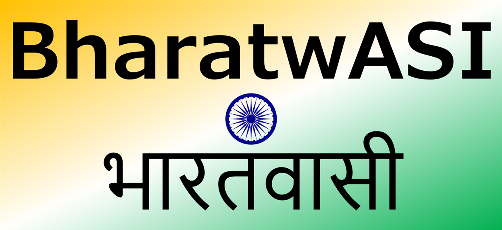

# 🇮🇳 BharatwASI - India's First Artificial Super Intelligence (ASI) Chatbot

## 🚀 Introduction

BharatwASI is India's first Artificial Super Intelligence (ASI) chatbot, designed to revolutionize AI interactions with deep, context-aware, and culturally enriched responses. Developed by Decima Technologies, BharatwASI is a step towards making India self-reliant in AI, offering an alternative to global models like OpenAI’s ChatGPT and Quant’s DeepSeek. This release contains both the chatbot and ASI model which needs to be compiled with the Dataset files provided.

BharatwASI is more than just a chatbot; it is a national initiative to ensure that India leads in the ASI race by developing its own faster, larger, and deeper AI models. This is just the beginning of a global ASI era, through it though small steps, we dream to leap big. While this initiative aims to have its own ASI Models which have been provided as a PoC in this release, we do recommend use of Llama, DeepSeek, Mistral, Falcon etc. This repo will be updated with more progress. Contributions are welcome.

## 🎯 Mission Statement & Vision

### Mission

India is determined to be self-dependent in the AI revolution by developing homegrown ASI models. While the world is racing to build cutting-edge AI, Decima Technologies is committed to positioning India as a global leader in the ASI segment.

### Vision

Develop a scalable ASI model trained on India-centric knowledge.

Create faster, larger, and deeper models than existing AI solutions.

Offer a secure, privacy-centric AI alternative for national and global users.

Ensure AI democratization, making AI accessible to everyone in India.

## 🌟 AI vs AGI vs ASI - Why India Must Focus on ASI

1️⃣ Artificial Intelligence (AI) 

AI refers to narrow intelligence that can perform specific tasks, such as chatbots, voice assistants, and recommendation systems. It lacks the ability to reason beyond pre-programmed logic.

2️⃣ Artificial General Intelligence (AGI) 

AGI represents human-like intelligence, capable of understanding, learning, and reasoning across various domains without needing constant human intervention. AGI is yet to be achieved.

3️⃣ Artificial Super Intelligence (ASI) 

ASI surpasses human intelligence in all aspects, including reasoning, creativity, and decision-making. It has the potential to solve complex problems beyond human capabilities.

### Why India Should Focus on ASI?

#### ✅ Strategic Advantage: Leading in ASI ensures India’s technological and economic dominance.

#### ✅ Self-Reliance: A homegrown ASI model reduces dependency on Western AI giants.

#### ✅ Security & Sovereignty: ASI developed in India ensures data privacy and aligns with national interests.

#### ✅ Cultural Representation: BharatwASI is designed to understand Indian languages, history, and culture better than global AI models.

## 📌 Features

✅ Artificial Super Intelligence (ASI) - Goes beyond traditional AI, enabling human-like reasoning and problem-solving.

✅ India-Centric Training - Trained on India’s history, culture, science, and technology.

✅ Multilingual Support - Supports Hindi, English, Tamil, Telugu, Bengali, Marathi, and more.

✅ Faster & Efficient - Optimized for low-latency, real-time responses.

✅ Open API - Ready for integration into applications, websites, and enterprises.

✅ Privacy & Security Focused - 100% secure, ensuring data integrity & confidentiality.

## 📦 Repository Contents

BharatwASI/

│── data/                           # Training and fine-tuning data

│── models/                         # Trained models and checkpoints

│── src/                            # Source code

│   │── api.py                      # REST API to interact with chatbot

│   │── chatbot.py                  # Core chatbot logic

│   │── train.py                     # Model training and fine-tuning script

│   │── infer.py                     # Model inference script

│   │── config.py                    # Configuration settings

│   │── utils.py                     # Helper functions

│── frontend/                        # UI for chatbot interaction

│── requirements.txt                 # Dependencies

│── README.md                        # Documentation

│── Dockerfile                       # Containerization

│── deploy.sh                        # Deployment script

│── tests/                           # Unit and integration tests

## 🛠️ Setup & Installation

### 1️⃣ Clone the Repository

git clone https://github.com/DecimaASI007/BharatwASI.git
cd BharatwASI

### 2️⃣ Install Dependencies

pip install -r requirements.txt

### 3️⃣ Run the API Server

uvicorn src.api:app --host 0.0.0.0 --port 8000

### 4️⃣ Test the Chatbot

curl -X POST "http://127.0.0.1:8000/chat" -H "Content-Type: application/json" -d '{"message": "Hello!"}'

## 🚀 Model Training & Fine-Tuning using Llama 2 7b

1️⃣ Downloading Meta-LLaMA 2 (7B)

Meta has released LLaMA 2 models via Hugging Face. Follow these steps to download and load the model:

Step 1: Install Dependencies

pip install transformers accelerate torch sentencepiece

Step 2: Login to Hugging Face CLI (Required for LLaMA 2)

huggingface-cli login

You will need a Hugging Face account to access Meta-LLaMA models. Sign up at Hugging Face if you don’t have an account.

Step 3: Load the Model in Python

from transformers import AutoModelForCausalLM, AutoTokenizer

MODEL_NAME = "meta-llama/Llama-2-7b-chat-hf"

tokenizer = AutoTokenizer.from_pretrained(MODEL_NAME)

model = AutoModelForCausalLM.from_pretrained(MODEL_NAME)

2️⃣ Why Choose Meta-LLaMA 2 (7B)?

LLaMA 2 (7B) is an optimized and efficient model, making it ideal for BharatwASI’s first phase due to: 

✅ High Performance – Strong reasoning and language understanding.

✅ Open Source – Freely available, unlike OpenAI’s models.

✅ Scalability – Can be trained/fine-tuned efficiently with LoRA.

✅ Reduced Compute Cost – Runs on mid-range GPUs compared to larger models.

However, we are not limited to LLaMA 2. We can explore other models like DeepSeek, Mistral, Falcon, or LLaMA 3 when available.

3️⃣ Alternative Models We Can Use

If you want something more powerful or optimized for BharatwASI, here are some alternatives:

#### Model	Parameters	Advantages

DeepSeek 7B	7B	Newer than LLaMA 2, strong performance

Mistral 7B	7B	Optimized with grouped-query attention (faster)

Falcon 7B	7B	Arabic-friendly, strong multilingual support

LLaMA 3 (Upcoming)	TBD	Next-gen Meta AI model

Mistral Mixtral 8x7B	12B active	Sparse MoE, highly efficient

LLaMA 2 (13B or 65B)	13B+	More power, but needs high GPU

### Steps

Train the Model

python src/train.py

Inference (Testing the Model)

python src/infer.py

## 🛠️ Model Training & Fine-Tuning (Using DeepSeek-R1)

### Downloading and Using DeepSeek-R1 (671B Parameters)

DeepSeek-R1 is one of the most advanced open-weight AI models, making it ideal for training BharatwASI as compared to OpenAI models. You may download the models by visiting https://github.com/deepseek-ai/DeepSeek-R1.

#### Huggingface Links: 

DeepSeek-R1 Models:

Model 	#Total Params 	#Activated Params 	Context Length 	Download

DeepSeek-R1-Zero 	671B 	37B 	128K 	🤗 HuggingFace - https://huggingface.co/deepseek-ai/DeepSeek-R1-Zero

DeepSeek-R1 	671B 	37B 	128K 	🤗 HuggingFace - https://huggingface.co/deepseek-ai/DeepSeek-R1

1️⃣ Install Dependencies

pip install transformers accelerate torch sentencepiece

2️⃣ Load DeepSeek-R1 in Python

from transformers import AutoModelForCausalLM, AutoTokenizer

MODEL_NAME = "deepseek-ai/DeepSeek-R1"

tokenizer = AutoTokenizer.from_pretrained(MODEL_NAME)
model = AutoModelForCausalLM.from_pretrained(MODEL_NAME)

3️⃣ Train the Model

python src/train.py

4️⃣ Inference (Testing the Model)

python src/infer.py

## 🔗 API Usage

BharatwASI provides a REST API for chatbot interaction.

POST /chat

Request:

{
  "message": "What is ASI?"
}

Response:

{
  "response": "Artificial Super Intelligence (ASI) refers to an AI system surpassing human intelligence."
}

## 🚢 Deployment (Docker)

Build & Run Docker Container

docker build -t bharatwasi .
docker run -d -p 8000:8000 --name bharatwasi_container bharatwasi

## 🌏 Why BharatwASI Matters for India

🔹 National AI Leadership - India’s first ASI-powered chatbot.

🔹 Self-Reliant AI Ecosystem - No dependency on global AI providers.

🔹 Cultural & Linguistic Representation - ASI that understands India better than any other chatbot.

🔹 Open-Source & Collaborative - A community-driven initiative to enhance ASI capabilities for all.

## 🤝 Contribution Guidelines

We welcome contributions! If you’d like to contribute:

1️⃣ Fork the repo & create a feature branch.

2️⃣ Make changes & commit with meaningful messages.

3️⃣ Submit a pull request for review.

## 🏆 Acknowledgements

A special thanks to Decima Technologies and Dr. Yuvraj Kumar for pioneering India’s journey into Artificial Super Intelligence. This project is dedicated to the advancement of AI, AGI, and ASI in India and its mission to become a global ASI leader.

## 📢 Spread the Word!

Join us in making BharatwASI a national ASI success story! 🚀

### 💬 Follow & Support: Decima Technologies
### 📌 Use Hashtags: #BharatwASI #ASI #AIforIndia #DecimaASI #IndiaAI #Bharat #India
### 📢 Share: Let’s build India’s ASI future together! 🇮🇳

